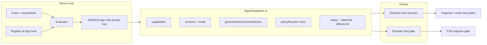

# SIGNED-LICENSE-RIGHTS-DELIVERY-006

```text
STATUS = IN PROGRESS (006+2A+2B code ready · tests PASS · operator Ed25519 deploy + desktop release pending)
TYPE = Signed license rights delivery (Server → Desktop → Browser)
DEPENDS = LICENSE-VERSION-CONTRACT-CLOSURE-005 · GENERATION-ENFORCEMENT-WEB-AND-DESKTOP-003
```

## Objective

Deliver and verify license version **rights** from server signature through Desktop and Browser executors. Worker env, renderer flags, and local storage are not license authority.

## Rules observed

- No deploy or commercial enforcement activation in this phase.
- Test-only key material in checks.
- Public download and document recovery unchanged.

---

## Phase 2A closeout (2026-09-23)

### Production Worker secrets (names only)

`wrangler secret list` on Worker `suhuella`:

`CF_ACCESS_AUD`, `CF_ACCESS_TEAM_DOMAIN`, `CLOUDFLARE_ACCOUNT_ID`, `CLOUDFLARE_API_TOKEN`, `CLOUDFLARE_SAAS_ZONE_ID`, `CLOUD_GOOGLE_DRIVE_CLIENT_ID`, `CLOUD_GOOGLE_DRIVE_CLIENT_SECRET`, `CLOUD_TOKEN_ENCRYPTION_KEY`, **`LICENSE_SIGNING_SECRET`**, `RESEND_API_KEY`, Stripe price IDs, `STRIPE_SECRET_KEY`, `STRIPE_WEBHOOK_SECRET`, `SUPERADMIN_EMAILS`

**Not yet in production:** `LICENSE_SIGNING_PRIVATE_KEY`, `LICENSE_SIGNING_PUBLIC_KEYS`, `LICENSE_EMAIL_OTP_SECRET`, `PARTNER_SESSION_SECRET`

Production still signs and verifies license tokens with **HMAC legacy** only. Offline Ed25519 on Desktop requires (a) build public-key wiring — **done in code** — and (b) operator deploy of `LICENSE_SIGNING_PRIVATE_KEY` + matching `SUHUELLA_LICENSE_VERIFY_PUBLIC_KEYS` at desktop release build time.

### Desktop build wiring (2A.2 — DONE)

- `desktop/scripts/electron-esbuild.mjs` embeds `SUHUELLA_LICENSE_VERIFY_PUBLIC_KEYS` via esbuild `define` (same pattern as `__SUHUELLA_BUILD__`).
- `desktop/scripts/license-build-inlining-check.mjs` asserts bundled `main.cjs` contains the public key string.
- `desktop/electron/license-offline-verify-check.ts` functional verify for Ed25519 tokens.
- `desktop/scripts/package-check.mjs` requires keys for release builds (`SUHUELLA_DESKTOP_CI=1` warns only).

Verify locally:

```bash
# Generate test keypair (or use site/lib/test/license-signing-fixtures.ts)
export SUHUELLA_LICENSE_VERIFY_PUBLIC_KEYS="<SPKI public base64url>"
export TEST_LICENSE_SIGNING_PRIVATE_KEY="<PKCS#8 private base64url>"  # optional; matches public key
cd desktop && npm run build
npm run test:license-build-inlining
npm run test:license-offline-verify
```

### Secret separation (2A.3 — DONE in code)

| Secret | Role |
| --- | --- |
| `LICENSE_SIGNING_SECRET` | Legacy HMAC license tokens only (server) |
| `LICENSE_SIGNING_PRIVATE_KEY` | Ed25519 sign new license tokens (server) |
| `LICENSE_SIGNING_PUBLIC_KEYS` | Ed25519 verify allowlist (server) |
| `LICENSE_EMAIL_OTP_SECRET` | Email OTP code hashing |
| `PARTNER_SESSION_SECRET` | Partner portal + applicant session cookies |
| `SUHUELLA_LICENSE_VERIFY_PUBLIC_KEYS` | Desktop **build-time** public key allowlist (not a Worker secret) |

Rotating `LICENSE_SIGNING_SECRET` no longer affects OTP or partner sessions once production has the new secrets deployed.

**Operator actions still required:**

```bash
cd site
npx wrangler secret put LICENSE_SIGNING_PRIVATE_KEY
npx wrangler secret put LICENSE_SIGNING_PUBLIC_KEYS
npx wrangler secret put LICENSE_EMAIL_OTP_SECRET    # new value, distinct from LICENSE_SIGNING_SECRET
npx wrangler secret put PARTNER_SESSION_SECRET      # new value, distinct from LICENSE_SIGNING_SECRET
# Keep LICENSE_SIGNING_SECRET until Phase 2B retires legacy HMAC tokens
```

---

## Trust chain (asymmetric)



| Step | Who | What |
| --- | --- | --- |
| 1 | `license-service.ts` | Reads grant, acquisitions, registry; computes **effective capabilities** |
| 2 | `buildSignedLicenseContext` | Canonical JSON + **Ed25519** (`LICENSE_SIGNING_PRIVATE_KEY` server-only) |
| 3 | `readSignedLicenseToken` / `verifyLicenseSignature` | Verify with **public key allowlist** — not sufficient alone |
| 4 | `validateSignedLicensePayload` | Structure + coherence after verify |
| 5 | `assertSignedExecutorRights` | Entitlement dates + **membership in signed `capabilities[]`** |

**Never embed an HMAC secret in Desktop or Browser.** Clients embed **public keys only** (`SUHUELLA_LICENSE_VERIFY_PUBLIC_KEYS`). Allowed algorithm: `ed25519` (explicit prefix on token).

Legacy HMAC tokens (`body.sig` without prefix) may still verify on the **server** during transition if `LICENSE_SIGNING_SECRET` is set. Clients reject them.

---

## Signed contract v1 fields

| Field | Role |
| --- | --- |
| `signedContractVersion` | `1` — absent on pre-006 tokens |
| `capabilities` | Effective rights at issuance |
| `acquiredCommercialGenerationIds` | Cumulative versions |
| `commercialGenerationId` | Original purchased version |
| `generationAccessMode` | Access pattern |
| `generationEnforcementActive` | Signed enforcement bit — **not** Worker env on client |
| `policyRevision` | Hash of registry rows at sign (`gen_…`) |
| `lastCheckedAt` / `offlineUntil` / `validUntil` / `status` | Entitlement boundaries |

---

## Desktop

- `license-signature-verify.ts`: dual-verify — Ed25519 crypto offline with embedded **public keys**; HMAC legacy via online-attested grace within `offlineUntil` (no symmetric secret in client).
- `license-store.ts`: delegates to `verifyLicenseSignature` on read/save; reject tampered cache.
- `license-rights.ts`: `assertSignedExecutorRights` — no `COMMERCIAL_GENERATION_ENFORCEMENT_ENABLED` on client.
- Offline: executor trusts **stored signed token** while `offlineUntil` is in the future — refresh is not required inside grace.

## Browser

- `generation-executor-gate.ts`: same signed-capability gate (host module — not a substitute for real browser runtime tests).
- Server routes remain authoritative for activation and check.

---

## Tests

```bash
npm run test:signed-license-rights-delivery --prefix site
npm run test:generation-enforcement --prefix site
npm run test:license-version-contract-closure --prefix site
cd desktop && npm run test:license
cd desktop && npm run test:license-dual-verify
npm run test:license-hmac-retirement-2b --prefix site
cd desktop && npm run test:license-offline-verify   # with SUHUELLA_LICENSE_VERIFY_PUBLIC_KEYS set
cd desktop && npm run test:license-build-inlining   # after production build
npm run test:license-signing   # from repo root — signing + dual-verify + 2B metrics
```

---

## Activation strategy (operator — still BLOCKED)

1. Close commercial legacy policy ([LICENSE-VERSION-MODEL-001.md](./LICENSE-VERSION-MODEL-001.md)).
2. Deploy Ed25519 signing secrets on Worker + ship Desktop build with matching **public key allowlist**.
3. Run executor matrix on real devices (IPC tamper, patched binary).
4. Enable `COMMERCIAL_GENERATION_ENFORCEMENT_ENABLED` on Worker **only** when signing includes enforcement bit.

Phase **2B** (dual-verify grace, retire HMAC) — see [LICENSE-HMAC-RETIREMENT-2B.md](./LICENSE-HMAC-RETIREMENT-2B.md). Dual-verify client landed; HMAC secret retirement pending objective D1 criteria.

---

## Files changed (Phase 2A)

| Area | Path |
| --- | --- |
| Desktop build | `desktop/scripts/electron-esbuild.mjs`, `build.mjs`, `package-check.mjs`, `license-build-inlining-check.mjs` |
| Desktop verify | `desktop/electron/license-offline-verify-check.ts` |
| Secret split | `site/lib/email-verification.ts`, `site/lib/partners/session.ts`, `site/lib/partners/applicant-session.ts` |
| Dev defaults | `site/lib/dev/env-defaults.ts`, `site/scripts/load-dev-vars.mjs`, `site/.dev.vars.example` |
| Docs | `site/README.md`, this file |
